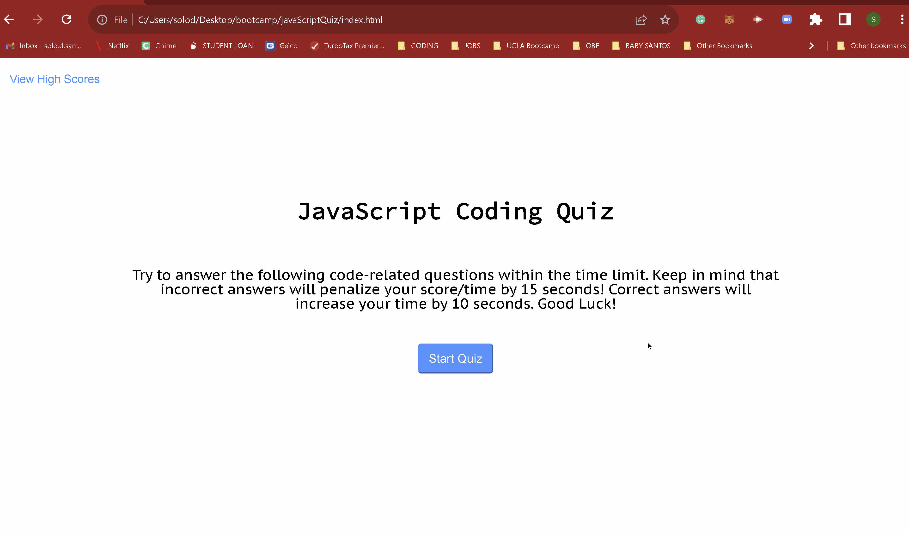
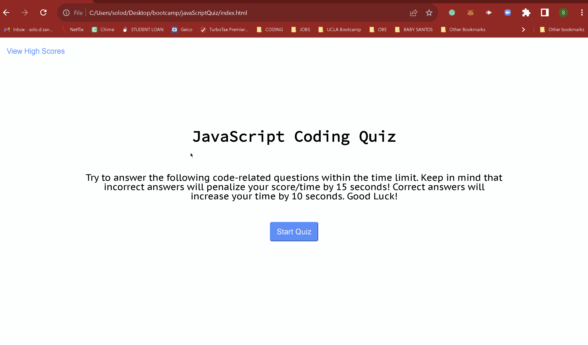

# JavaScript Quiz

## Technology Used

| Technology Used         | Resource URL           | 
| ------------- |:-------------:| 
| HTML    | [MDN - HTML](https://developer.mozilla.org/en-US/docs/Web/HTML) | 
| CSS     | [MDN - CSS](https://developer.mozilla.org/en-US/docs/Web/CSS)      |   
| Git     | [GIT - Docs](https://git-scm.com/doc)     |    
|JavaScript | [MDN - JS](https://developer.mozilla.org/en-US/)

## Description

Try the quiz [here](https://captaiiinsolo.github.io/javaScriptQuiz/index.html)

For this project I was tasked with creating a timed, multiple choice quiz. The quiz needed to have the following features:
        
        1. A button start that starts the quiz
        2. A timer that starts with the quiz
        3. Questions and answer options that appear dynamically 
        4. When all questions have been answered or the timer reaches zero, the game is over.
        5. A page where users can see their high scores.

---


Quiz Win Example



---

Quiz Loss Example



## Usage 

When users navigate to the quiz home page, they are presented with 2 options: starting the quiz via the start quiz button or they can saved high scores (if it is your first time visiting the site and taking the quiz, there will be no scores saved yet). 

When users start the quiz a 30 second timer starts counting down. In addition to the timer, users are presented with a question and list of 4 options to choose from. Mouseing over the options will make the options grow letting the user know which option they are selecting. Questions answered correctly are rewarded with an additional 10 seconds added to the time remaining and get to advance to the next question. Questions answered incorrectly are penalized with 15 seconds deducted from time remaining and are not able to move on to the next question until correct answer is chosen.

If users succesfully complete the quiz, they will be prompted to enter their desired name and then will be redirected to the high scores page.

Should the users fail the quiz, they will be alerted to study more and then will be redirected to the index.html page.

## Author Info

```md
Solomon Santos


- [Portfolio](https://captaiiinsolo.github.io/portfolio/)

- [Github](https://github.com/captaiiinsolo)

- [LinkedIn](www.linkedin.com/in/solomon-santos)